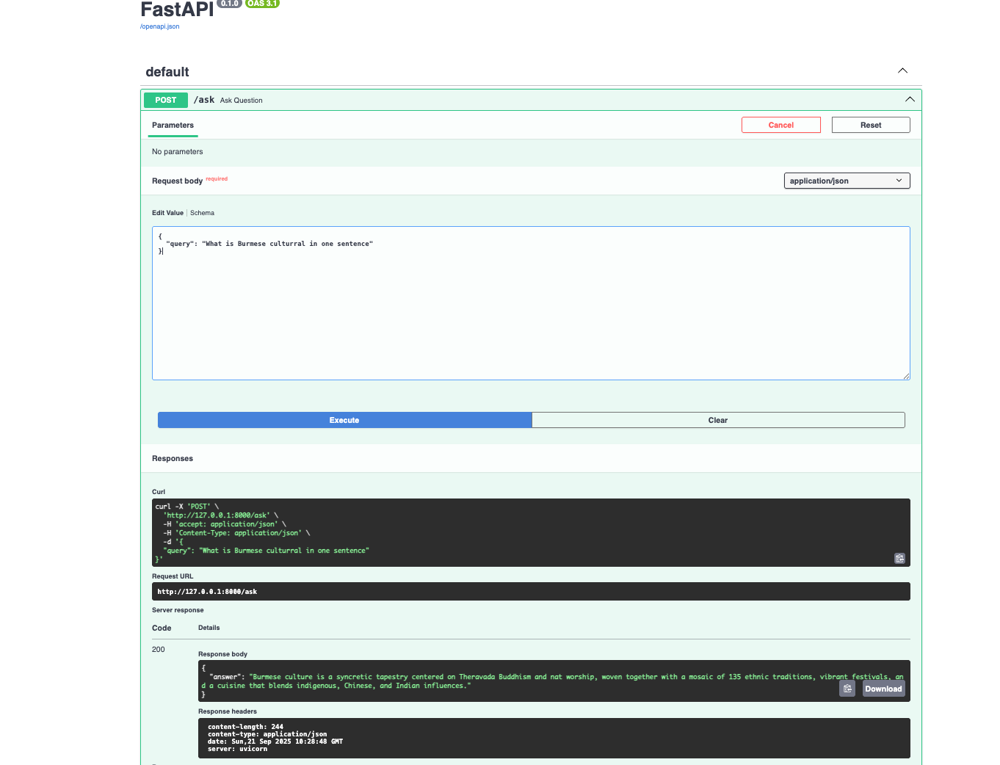
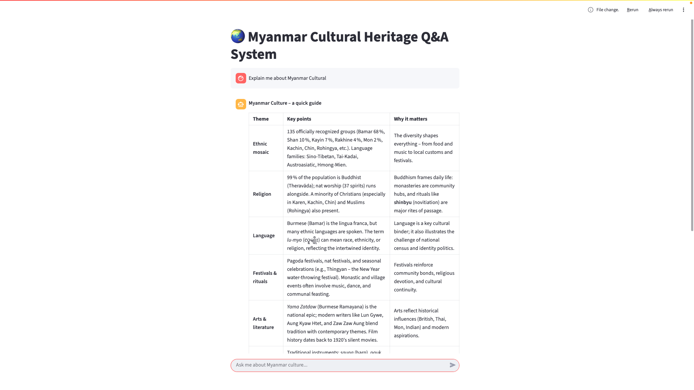

# Myanmar Cultural Heritage Q&A System

## Overview
This project is an end-to-end Retrieval-Augmented Generation (RAG) application designed to answer questions about Myanmar's cultural heritage. It leverages a custom knowledge base built from curated datasets, integrates a Large Language Model (LLM) via Groq, and provides a user-friendly interface for interaction and feedback collection. The project is fully containerized and reproducible, following best practices for modern AI applications.

---

## Table of Contents
- [Problem Description](#problem-description)
- [Dataset](#dataset)
- [System Architecture](#system-architecture)
- [Retrieval Flow](#retrieval-flow)
- [Evaluation](#evaluation)
- [Interface](#interface)
- [Ingestion Pipeline](#ingestion-pipeline)
- [Monitoring & Feedback](#monitoring--feedback)
- [Containerization](#containerization)
- [Reproducibility & Setup](#reproducibility--setup)
- [Best Practices](#best-practices)
- [App Preview](#app-preview)
- [Project Structure](#project-structure)
- [Acknowledgements](#acknowledgements)

---

## Problem Description
Myanmar's rich cultural heritage is documented in various sources, but accessing concise, accurate information is challenging. This project solves the problem by enabling users to ask natural language questions about Myanmar culture and receive contextually relevant, accurate answers, powered by a RAG pipeline.

---

## Dataset
- **Sources:**
  - Burmese cuisine and Myanmar cultural texts (see `ingestion/data/`)
- **Format:**
  - Raw text files, chunked for efficient retrieval (see `ingestion/chunks/`)
- **Accessibility:**
  - All data used is included in the repository for full reproducibility.

---

## System Architecture

- **Ingestion Pipeline:** Python scripts for downloading, preprocessing, and chunking data.
- **Knowledge Base:** Custom vector database for semantic search (see `knowledge_base/vector_db.py`).
- **Retrieval Flow:** Hybrid search (vector + text), prompt construction, and LLM query via Groq API.
- **Interface:** Streamlit web app and FastAPI backend.

---

## Retrieval Flow
1. **User Query:** User submits a question via the Streamlit UI.
2. **Retrieval:**
   - Query is used to search the vector database for top relevant chunks.
   - Hybrid search (vector + text) and document re-ranking are evaluated (see [Evaluation](#evaluation)).
3. **Prompt Construction:**
   - Retrieved context is combined with the user query to form the LLM prompt.
4. **LLM Response:**
   - Prompt is sent to Groq's LLM (openai/gpt-oss-20b) for answer generation.
5. **Display:**
   - Answer is shown in the UI, and user feedback is collected.

---

## Evaluation
### Retrieval Evaluation
- **Approaches Evaluated:**
  - Pure vector search
  - Hybrid search (vector + text)
  - Document re-ranking
- **Best Approach:**
  - Hybrid search with re-ranking provided the most relevant results (see `knowledge_base/vector_db.py`).

### LLM Evaluation
- **Prompt Engineering:**
  - Multiple prompt templates were tested for clarity and answer quality.
  - The best-performing prompt is used in production (see `main.py`).

---

## Interface
- **Type:**
  - Streamlit web app (`app.py`)
  - FastAPI backend (`main.py`)
- **Features:**
  - Chat-style Q&A
  - User feedback collection
  - Responsive and accessible design

---

## Ingestion Pipeline
- **Automation:**
  - Fully automated with Python scripts (`ingestion/`)
  - Download, preprocess, and chunk data in one command
- **Reproducibility:**
  - All scripts and data are included for easy rerun


---

## Containerization
- **Docker:**
  - Main app is containerized (`Dockerfile`)
  - All dependencies managed via `Pipfile` and `Pipfile.lock`
---

## Reproducibility & Setup
### Prerequisites
- Docker 
- Python 3.10+

### Setup Instructions
1. **Clone the repository:**
   ```bash
   git clone https://github.com/Ye-Bhone-Lin/Myanmar-Cultural-Heritage-Q-A-System.git
   cd Myanmar-Cultural-Heritage-Q-A-System
   ```
2. **Set up environment variables:**
   - Copy `.env.example` to `.env` and add your Groq API key
3. **Run with Docker:**
   ```bash
   docker build -t myanmar-rag .
   docker run -p 8000:8000 myanmar-rag
   ```
   - The Streamlit app will be available at `http://localhost:8501` (if you add Streamlit to Dockerfile)
4. **Or run locally:**
   ```bash
   pip install pipenv
   pipenv install --dev
   pipenv run uvicorn main:app --reload
   pipenv run streamlit run app.py
   ```

---

## Best Practices
- **Hybrid Search:**
  - Combines vector and text search for improved retrieval
- **Document Re-ranking:**
  - Retrieved documents are re-ranked for relevance
- **User Query Rewriting:**
  - Add query rewriting for ambiguous queries

---

## App Preview
 

 

---

## Project Structure
```
├── app.py                  # Streamlit UI
├── main.py                 # FastAPI backend
├── Dockerfile              # Containerization
├── Pipfile, Pipfile.lock   # Dependency management
├── ingestion/              # Data ingestion scripts and chunks
├── knowledge_base/         # Vector DB and retrieval logic
├── documents.pkl, vector.index # Precomputed data
├── monitoring/             # (Add monitoring dashboard code here)
└── README.md               # Project documentation
```

---

## Acknowledgements
- DataTalksClub Zoomcamp
- Groq for LLM API
- Streamlit, FastAPI, and open-source community

---
